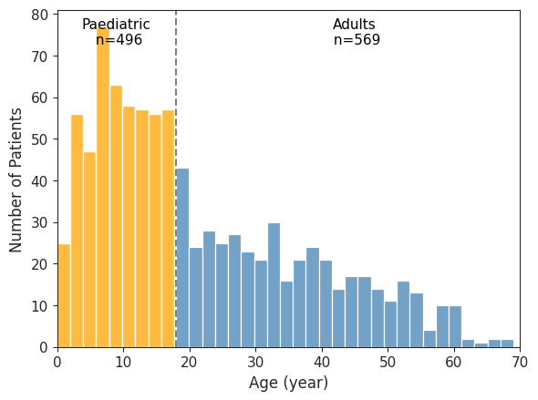
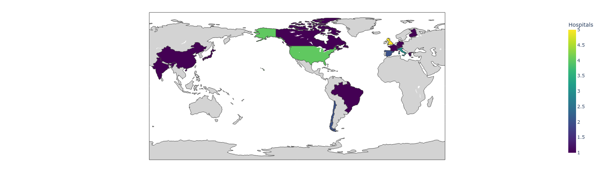
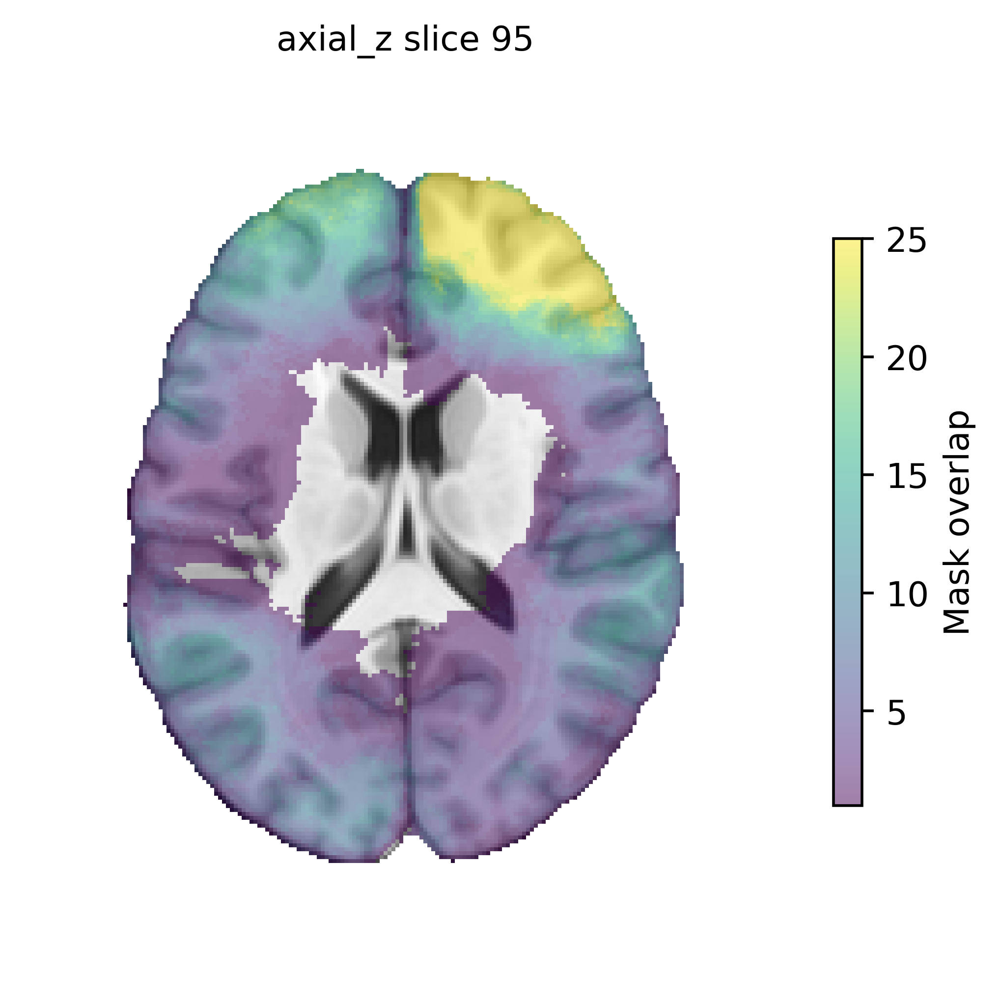

## :memo: Jupyter Notebooks for Figure & Table Reproduction

This repository provides Jupyter notebooks for recreating all figures and tables used in the project.  
Each notebook has specific input requirements, detailed below.

---

## Data Requirements

- **Subject metadata csv**  
  Must include subject IDs, demographics, and additional fields depending on the notebook (e.g., age information, country).
  for detailed template of subject metadata csv: [subject csv](https://github.com/MELDProject/MELD-PostOp/tree/main/notebooks#2-subject-metadata-csv)

- **Additional imaging data (for resection mapping)**  
  - MNI-registered resection cavity masks  
  - MNI template  
  - MNI brain mask  

---

## 01_Fig_age_distribution.ipynb

**Requirements:**
- The master CSV file must contain:
  - `age_at_surgery`, **or**
  - `age_at_preop_scan`
- The script prioritizes *age at surgery*. If missing, it uses *age at preoperative scan*.
- The notebook reports the number of subjects missing both pieces of information.

**Output:**
- Age distribution plot  
- Pediatric subjects (*age < 18*) plotted in **orange**  
- Adult subjects (*age ≥ 18*) plotted in **blue**

**Example:**  

---

## 02_Fig_site_worldmap.ipynb

**Requirements:**
- The master CSV file must include the **country** corresponding to each contributing site.

**Output:**
- A world map illustrating the geographic distribution of contributing sites.

**Example:**  

---

## 03_Fig_resection_distribution.ipynb

**Requirements:**
- MNI-registered resection cavity masks 
- MNI template  
- MNI brain mask  

**Functionality:**
- Resection masks are mapped onto MNI space.
- A density map is created with a maximum threshold of 25.
- Transparent background with colour bar 
- A total of **60 PNG images** are generated:
  - **3 anatomical planes** (sagittal, coronal, axial)
  - **20 slices** per plane

**Example:**  

